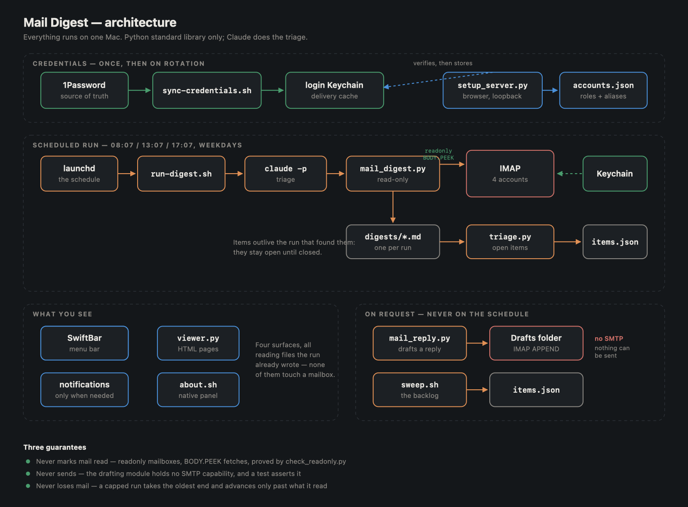
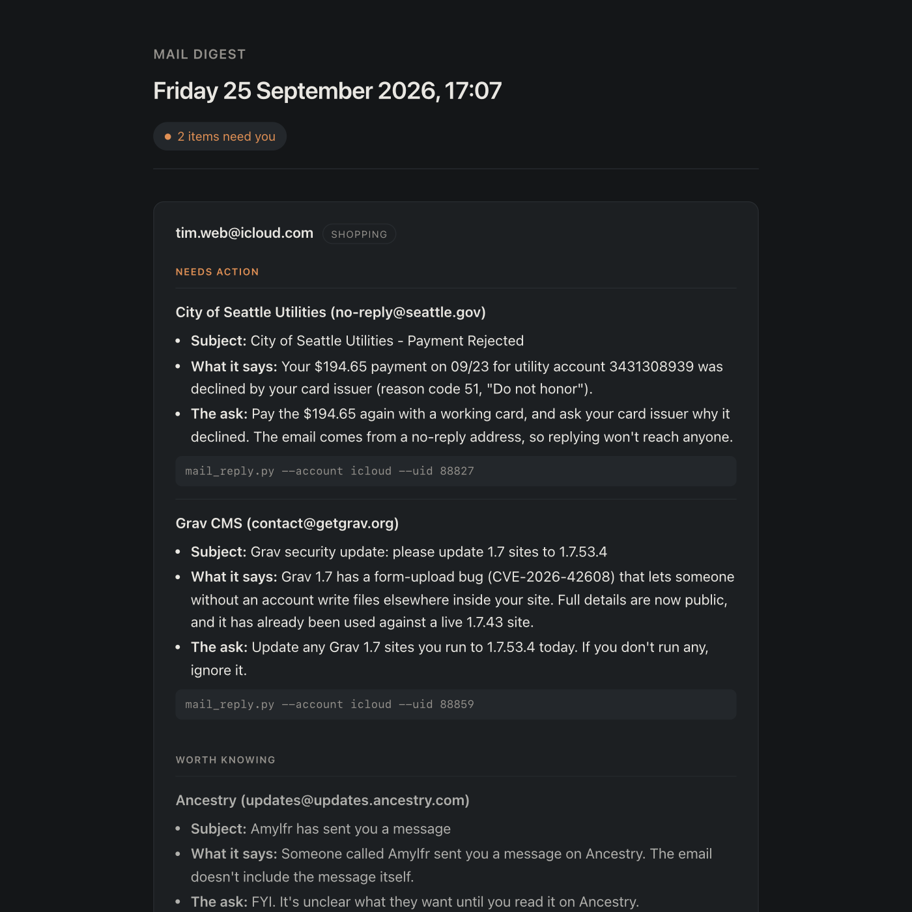
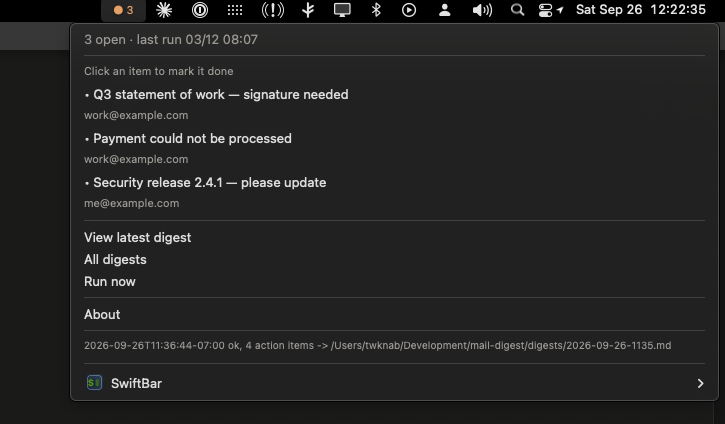
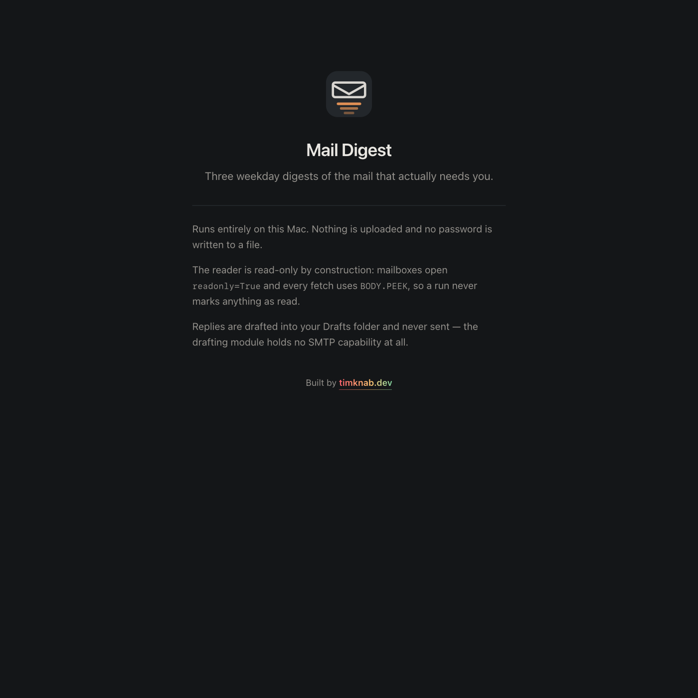

<p align="center">
  
</p>

<h1 align="center">Mail Digest</h1>

<p align="center">
  Three weekday digests of the mail that actually needs you, across every account you own.<br>
  Runs entirely on one Mac. Nothing is uploaded. No password is written to a file.
</p>

---

## What it does

Reads every configured IMAP account three times a weekday, drops the bulk, and
reports only what needs a person — grouped by **which of your addresses it
arrived at**. Anything actionable becomes an open item that stays in front of
you until you close it.

It can draft a reply into your Drafts folder, threaded correctly and **from the
address the message was sent to**. It cannot send.

## How it fits together



## Screenshots

**The digest** — grouped by the inbox each message arrived at, needs-action
accented, worth-knowing dimmed, every draft command a click-to-select chip.
(Sample data; the real thing shows your mail.)



**The menu bar** — open items listed under the dot, each a click to mark done.
They persist across runs, so something raised at 08:07 is still there at 13:07.



The dot itself carries the state:

| Dot | Means |
| --- | --- |
| green ● | all caught up |
| orange ● + count | that many items need you |
| blue ○ | a run is in flight; the dropdown shows the stage and a progress bar |
| orange ● | the last digest reported no item count — open it and check |

**About** — a native panel, showing the guarantees alongside live state:
accounts configured, items open, last run.



## Triage

A digest file is a snapshot of one run — an item raised at 08:07 is gone from
view by 13:07. So needs-action items go into a list that outlives the files:

```bash
python3 triage.py --list           # what is still open
python3 triage.py --done icloud:88827
python3 triage.py --refresh        # re-read digests to fill gaps
```

Items are keyed by the account and UID the draft handle already carries, stay
open until you close them, and closing is per item rather than per run. The
menu bar count is the number *open*, not the number in the newest digest.

## The backlog

The first real run sets a baseline at whatever the newest UID is, so the
schedule only ever looks forward. Everything older is unreachable by it —
often thousands of messages. `sweep.sh` walks backwards from that baseline in
batches, newest first, and feeds anything actionable into the same list:

```bash
./sweep.sh        # one batch of 25 per account
./sweep.sh 50
```

It never moves the forward baseline, and it only advances its own cursor past
messages that were genuinely triaged — a batch that failed is retried rather
than skipped.

## The three guarantees

**It never marks mail as read.** Mailboxes open `readonly=True` and every fetch
uses `BODY.PEEK`. This is not a promise, it is checkable:

```bash
python3 check_readonly.py > /tmp/before.json
python3 mail_digest.py --no-save --since-hours 24 > /dev/null
python3 check_readonly.py --compare /tmp/before.json   # must print PASS
```

**It never sends mail.** `mail_reply.py` writes drafts into your Drafts folder
and holds no SMTP capability at all — there is a test asserting the module
cannot import one.

**It never loses mail.** A run over its batch cap takes the *oldest* end and
advances the saved position only past what it actually read, so a backlog
drains over successive runs instead of being skipped.

## Why aliases drive the design

On providers that support them, several addresses deliver into **one** INBOX
behind a single login. The account therefore cannot say which of your
identities owns a message — only the delivery headers can.

That one fact drives three behaviours:

- the digest groups by the address a message arrived at, not by account;
- each address carries its own bundle — business, personal, shopping;
- a drafted reply goes out **from the address it was addressed to**, never the
  account's primary.

`identity_for` is shared between the reader and the drafter, so where a message
is filed and where a reply comes from can never disagree.

## Setup

```bash
python3 setup_server.py    # browser UI, loopback only
```

Pick a provider and the host, port and folder names fill themselves in. It logs
in to verify before storing anything, and the password goes straight to your
Keychain. Full instructions, including the scheduled job and notifications, are
in [SETUP.md](SETUP.md).

Providers are data, not code — add an entry to
[`providers.json`](providers.json) and it appears in the setup UI. iCloud,
Gmail, Fastmail, Proton Bridge and generic IMAP ship with it.

## Requirements

macOS (for the Keychain and launchd) and Python 3.9+. **No dependencies** —
everything used is in the standard library. [SwiftBar](https://swiftbar.app) is
optional but recommended: it provides the menu bar, and macOS will only deliver
notifications through a properly signed app.

## Tests

```bash
for t in test_mail_digest test_junk_actions test_mail_reply test_setup_server test_triage; do
  python3 $t.py || break
done
```

No network and no mailbox required.

---

## Licence

[MIT](LICENSE) — Copyright (c) 2026 Tim Knab.

---

<p align="center"><sub>Built by <a href="https://timknab.dev">timknab.dev</a></sub></p>
